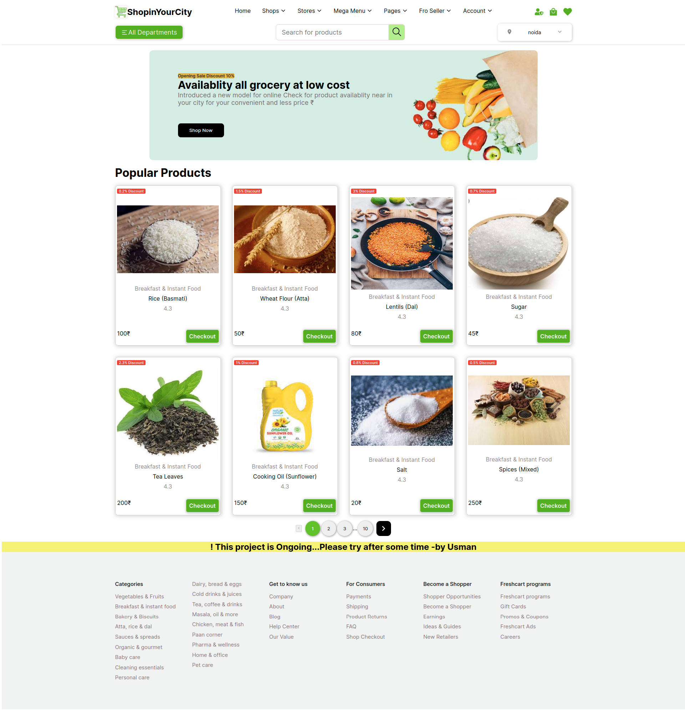
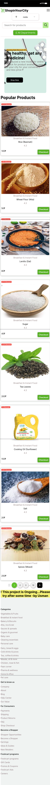

# Shopping-in-Your-City - PROJECT IS UNDER PROCESS WE ARE WORKING ON IT
1. Stock/Product Availability in market  nearby.
   E-commerce majors such as Flipkart, Amazon India, have been
   growing steadily on a large scale. Where we are providing
   facilities on small scale to those local
   shopkeepers who are struggling with
   ruination of their stocks due to not
   enough customer visit.
2. Finding the right shop(nearby)
where she/he can find all the desired product
on the go.


---
# Why Shopping-in-Your-City?
1. For sellers, we have provided them their own space where he/she can
update their information, information related to their products quality,
price of product and of course number of stocks available and so on.
2. After some formalities the seller will get to show his shop name on our
website by which the customer visit will be decent and stock
consumption will be on time(before expiry).
---

# Installation and Configuration

***It takes me lot of Time,Efforts,Research to build this awesome site, Do not forget to give me credit it***

```
$ npm install
```
```
$ npm start
```
# Collaboration
Always welcome you to join, and contribute some new feature and make it better.

# Screenshots & GIF

<div style="text-align:center;">
    
</div>
